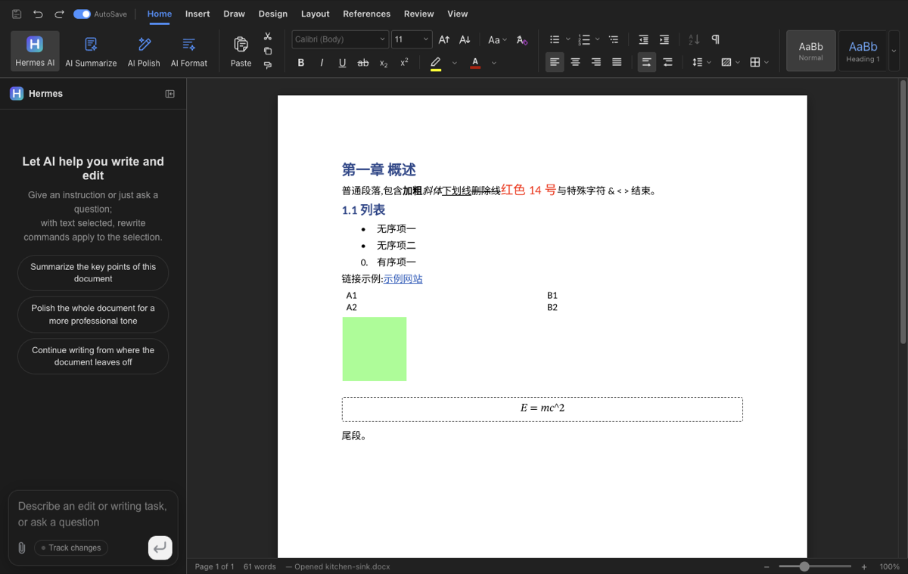
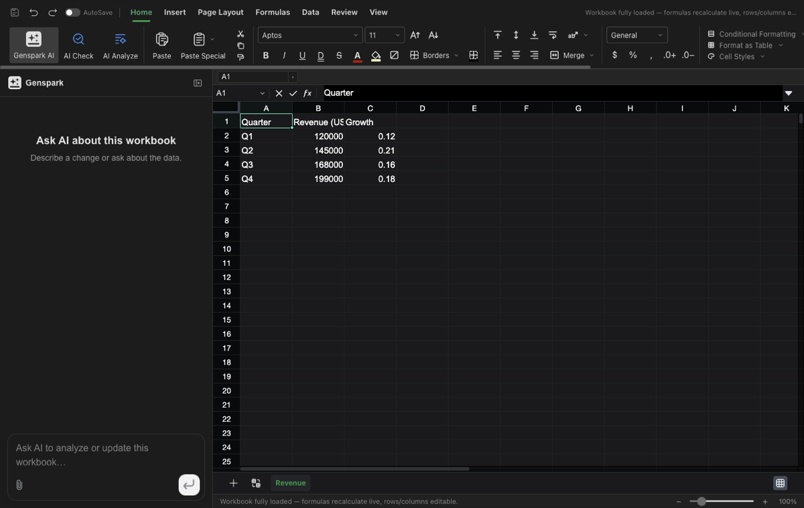
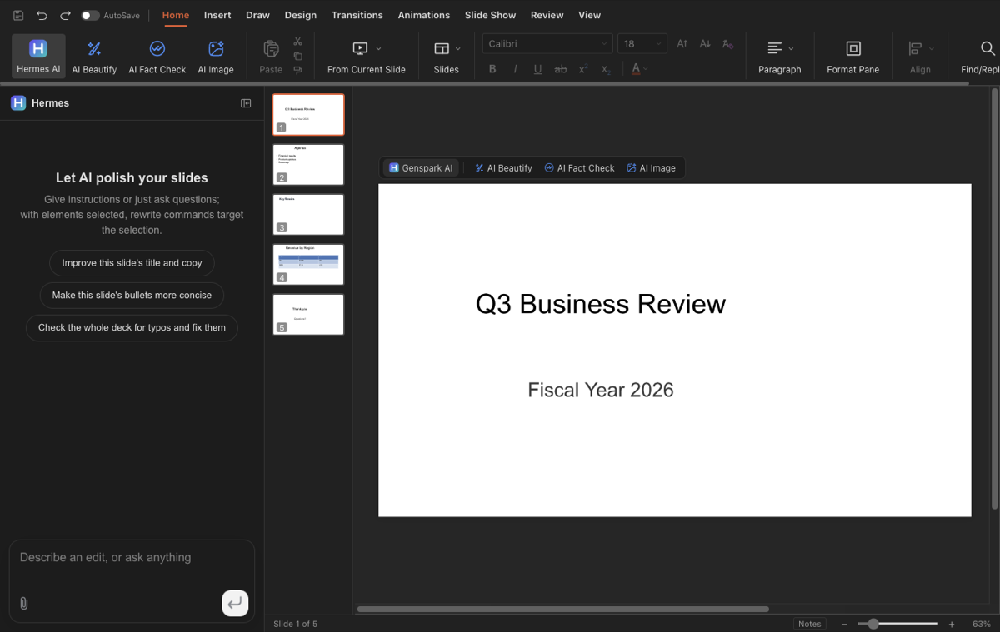
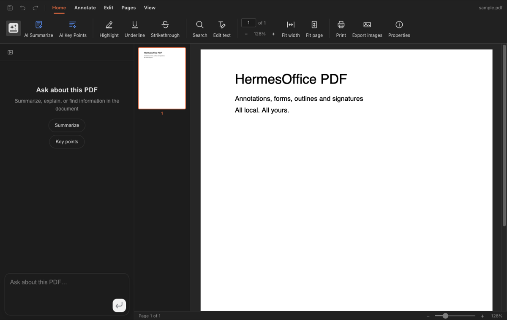

<div align="center">


# HermesOffice — the office where humans and agents work as one team

**AI-native office suite for macOS and Windows.** Docs, Sheets, Slides and PDF — built on open standards (`.docx`, `.xlsx`, `.pptx`), byte-preserving round-trip, with the **Hermes Agent** as the native brain. No cloud. No account. No lock-in.

[](LICENSE)
[](https://github.com/criptogus/HermesOffice/stargazers)
[](https://github.com/criptogus/HermesOffice/actions)
[](<>)
[](<>)

[Watch the demo](https://www.youtube.com/watch?v=B2pLdMX95v4) · [Roadmap](ROADMAP.md) · [Contributing](CONTRIBUTING.md) · [Security](SECURITY.md)

</div>

---

## Why HermesOffice

Most "AI office" tools bolt a chat panel onto a document. We inverted the model: **the document is the interface, and the agent is a collaborator** — with real context, memory and the ability to act.

- **Local-first by default.** Board material, CISO-grade conversations and NDAs never leave your machine. The Hermes Agent gateway runs on your computer — no API key, no cloud account.
- **Open standards, byte-preserving.** Opening and saving never breaks layout in Word, Excel or PowerPoint. Only the blocks you (or the agent) touched are regenerated; everything else survives the round trip byte-for-byte.
- **Agent-native, auditable.** Every AI mutation is visible and reversible — a unified _Proposed Change_ pipeline (diff preview → atomic apply) that the agent itself goes through, in every app.
- **Hermes is the backbone.** Identity, memory, sessions and skills come from the open-source [Hermes Agent](https://hermes-agent.nousresearch.com) — not from a proprietary cloud.

## Screenshots

| Docs                               | Sheets                                 |
| ---------------------------------- | -------------------------------------- |
|  |  |

| Slides                                 | PDF                              |
| -------------------------------------- | -------------------------------- |
|  |  |

## Apps

| App        | What it is                                                                                                                                                                                                                                                                    |
| ---------- | ----------------------------------------------------------------------------------------------------------------------------------------------------------------------------------------------------------------------------------------------------------------------------- |
| **Docs**   | `.docx` word processor. Byte-preserving round trip via paragraph-level patching; paginated view reproducing the original layout; tracked changes, comments, styles, equations, ink.                                                                                           |
| **Sheets** | `.xlsx` spreadsheet on the open-source [Univer](https://github.com/dream-num/univer) core with in-house extensions; `.xlsx` import/export via an in-house Rust sidecar (calamine + IronCalc); charts (Konva), pivot tables, slicers, conditional formatting, formula tracing. |
| **Slides** | `.pptx` presentations. In-house parse/render/edit engine: masters, charts, cropping, ink, text shaping (HarfBuzz metrics).                                                                                                                                                    |
| **PDF**    | `.pdf` viewer/editor on pdf.js + pdf-lib: annotations, forms, outlines, stamps, signatures, page operations, printing.                                                                                                                                                        |
| **Shell**  | The suite shell: home screen, tabbed hosting of the four editors, auto-update.                                                                                                                                                                                                |

Every app embeds the same AI panel: block-granular AI editing with version snapshots and diffs in Docs; a tool-calling agent over workbook/slide/PDF state in the others.

## The agent, natively

HermesOffice talks to the **Hermes Agent** through a local OpenAI-compatible gateway (`http://127.0.0.1:8642`):

- **Hermes is the default provider** — no external account to create.
- **Per-document session continuity** — the agent remembers the conversation for each document (`X-Hermes-Session-Id`), across sessions and machines.
- **Trusted Agent Actions** — edits arrive as proposals with diff preview; accept, reject or roll back. The same pipeline gates external agents via the MCP server (roadmap P0).

## Install & run

> The fork ships as a **release train** (`ho-v*` tags) with source-based auto-update. Installers are built from `main`; no prebuilt binaries are hosted on GitHub Releases yet.

**macOS (Apple Silicon / Intel):**

```bash
git clone https://github.com/criptogus/HermesOffice.git
cd HermesOffice
npm install
npm run dist:mac          # → apps/shell/release/HermesOffice-*.dmg
```

**Windows:**

```bash
git clone https://github.com/criptogus/HermesOffice.git
cd HermesOffice
npm install
npm run dist:win          # → apps/shell/release/HermesOfficeSetup-*.exe
```

**Development:**

```bash
npm install
npm run fixtures          # generate test .docx fixtures
npm run dev               # all four editors + shell against Vite dev servers
npm run dev:docs          # a single app (same pattern per workspace)
```

The sheets app additionally needs a Rust toolchain for its xlsx sidecar (`cargo` on PATH).

## Engine packages

All pure TypeScript, no Electron dependency, unit-tested:

- `packages/docx-engine` — docx parsing → block tree (with `docxIndex` anchors and passthrough), OOXML fragment generation, byte-level paragraph patching.
- `packages/pptx-engine` / `packages/pptx-render` — pptx model and rendering.
- `packages/file-parse` — text extraction for AI attachments.
- `packages/agent-core` — the AI agent loop and skill composition shared by every app.
- `packages/ai-provider` — provider abstraction and streaming for model backends.
- `packages/i18n`, `packages/ui`, `packages/project-store`, `packages/electron-utils` — shared i18n core, React UI kit, recent-files store, Electron main-process helpers.

## Architecture note (the docx round trip)

```
open docx ─► archive original by hash (never touched)
          ─► docx-engine parses word/document.xml top-level elements (w:p / w:tbl / …)
          ─► Block tree, each block anchored by docxIndex + original XML slice
          ─► Tiptap streaming editor (manual + AI editing, dirty tracking)
save      ─► dirty blocks → OOXML fragments (referencing existing styles only)
          ─► splice into original document.xml (untouched blocks keep original bytes)
          ─► repack zip; all other entries copied byte-for-byte
```

The same philosophy holds in sheets and slides: the original file is the source of truth, edits are applied as narrow patches, and everything the editor didn't touch survives the round trip untouched.

## Roadmap

Public and outcome-driven: [ROADMAP.md](ROADMAP.md). Current focus — **Phase 2 · Value Loops**: complete vertical workflows (meeting → minutes, report → deck, template → deliverable), live meeting minutes (100% local), the unified Proposed Change pipeline, and the embedded MCP server that lets _any_ agent — Hermes, Claude Code, yours — work on documents through the same trust layer.

## Contributing

See [CONTRIBUTING.md](CONTRIBUTING.md). Good starting points:

- `docs/hermes-integration.md` — how the Hermes brain plugs into the apps.
- `packages/agent-core` — the agent loop shared by all apps.
- `packages/docx-engine` — byte-preserving paragraph patch.
- Issues labeled [`good-first-issue`](https://github.com/criptogus/HermesOffice/labels/good%20first%20issue).

## Security

See [SECURITY.md](SECURITY.md) for the process security posture (renderer sandboxing, IPC validation, external-link gating) and the threat models for AI-generated content.

## License

[Apache License 2.0](LICENSE), with one exception: the `ee/` directory is reserved for future enterprise modules and is covered by the [HermesOffice Enterprise License](ee/LICENSE).

Built on the open-source [GenOffice](https://github.com/genspark-ai/genoffice) (Apache-2.0) — a thin fork that keeps engines and app shells aligned with upstream while adding the Hermes integration, product identity and collaboration features.
